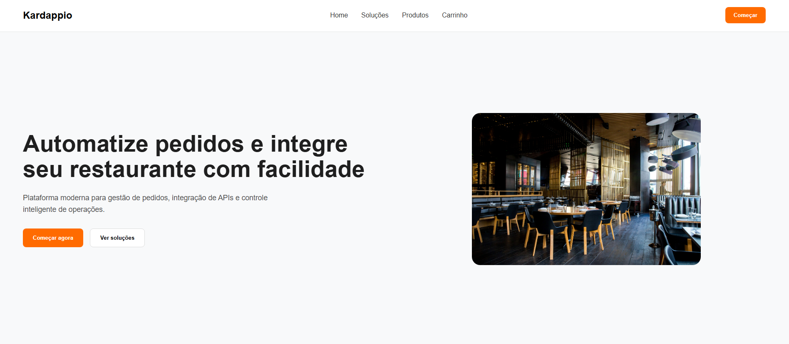
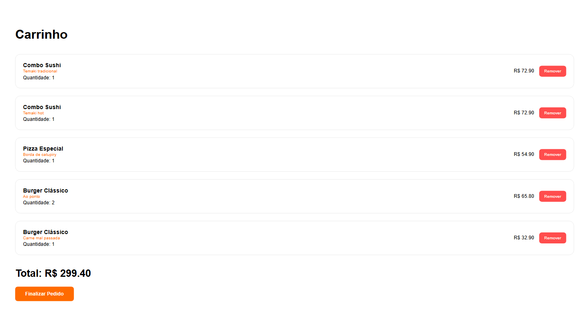
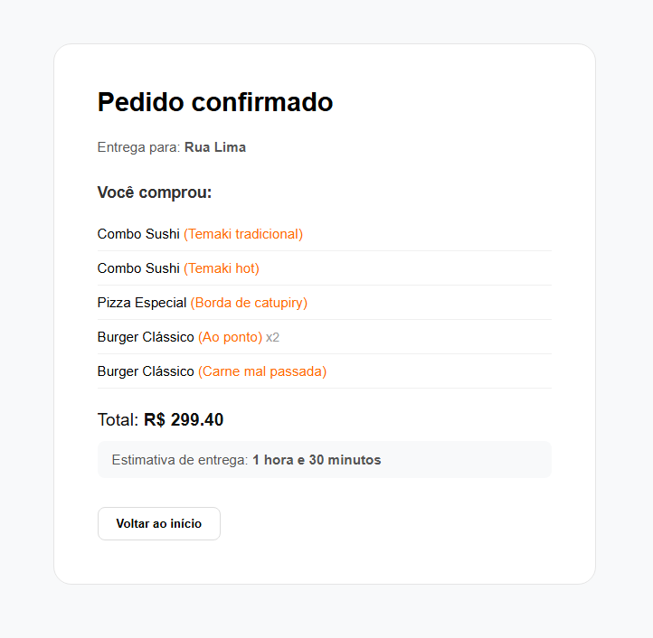

# Desafio Técnico FullStack

Este é o repositório da minha solução para a avaliação técnica. O projeto engloba o frontend da aplicação e o desenho da arquitetura de integração. Criei um E-commerce fictício para restaurantes. Um protótipo que poderia ser expandido para um Saas de cardápios ou ser utilizado como site completo de delivery.

## Demonstração visual

### A Primeira Impressão
A página inicial foca na conversão e em demonstrar o valor da plataforma.
<p align="center">
  
</p>
### Soluções e Produtos em Destaque
Apresentação clara de funcionalidades (Integração, Gestão, Dashboard) e o catálogo de produtos integrado.
(Isto é apenas uma demonstração, o sistema não inclui Dashboard e gestão, mas a possibilidade de integração e
expansão.)
<p align="center">
  
</p>
### Fluxo de Pedido
Experiência fluida desde a revisão do carrinho até a confirmação da compra.
<p align="center">
  
  &nbsp;
  
</p>

## Como rodar localmente

```bash
git clone https://github.com/seu-usuario/seu-repositorio.git
cd seu-repositorio
npm install
npm run dev
```
Este projeto foi desenvolvido na versão v24.15.0 do Node.js. Portanto, verifique sua versão com o comando:

```bash
node -v
```
Caso for anterior e/ou estiver tendo problemas de build, certifique-se de atualizar a versão do seu node para rodar o projeto.

## Arquitetura e Decisões do Frontend

Tentei manter o código direto e limpo. Algumas escolhas principais que fiz no desenvolvimento:

**API Mockada**
Para simular um cenário real de e-commerce, optei por não usar um Context API global para o carrinho. Em vez disso, criei um hook (`useAPI`) que faz chamadas assíncronas simulando a persistência (para ficar mais parecido com um backend) e salva os dados no `localStorage`. Para manter a tela do carrinho atualizada automaticamente quando um produto é adicionado, utilizei eventos nativos do DOM (`dispatchEvent`), deixando a árvore do React mais limpa e sem providers desnecessários.

**Componentização e Rotas**
As páginas foram separadas dos componentes visuais. Isolei o roteamento no `routes.jsx` para não poluir o `App.jsx` e mantive os hooks próximos de onde são realmente usados (colocation) para facilitar a leitura projeto.

Obs: Eu particularmente decidi não usar o padrão estrito de Smart e Dumb (Onde só a página é inteligente e repassa tudo via propriedades), apesar de iniciar o projeto com isso em mente e depois ter mudado de ideia. Apesar de ser o padrão de ouro na época do Redux, se eu seguisse o padrão estrito para esse teste, a minha página Home.jsx teria que ser a "Smart", obrigada a importar os dados do carrinho, função de deletar item, apenas para repasse via props para dentro de Cart e do ProductCard. Entraríamos ai na geração do Prop Drilling. A Home ficaria gigantesca, gerenciando estados que ela nem usa.

**Estilização**
Optei por CSS Modules (`.module.css`). Assim, o estilo de um botão não vai vazar e quebrar o layout de outra tela. Tudo dentro de Components ao inves de separados em uma pasta Style.

**Imagens e Assets**
Preferi baixar e otimizar as imagens (Utilizando TinyPng) direto na pasta do projeto em vez de usar links externos. É mais seguro e evita que alguma imagem quebre caso a URL de origem saia do ar durante o teste.

**Expansão**
Deixei a estrutura com uma camada de serviço (Service Layer) separada. Se no futuro for necessário plugar uma API real de pagamentos, cálculo de frete ou autenticação, a base já está engatilhada.

## Integração e Banco de Dados (Tarefa 2)

A documentação detalhando o banco e a pipeline está dividida nestes arquivos:

- [Documentação do Pipeline](./integration-flow/flow-documentation.md)
- [Queries SQL](./integration-flow/queries.sql)
- [Esquema do Banco](./database-schema.md)
- [Documentação da API](./api-documentation.md)
